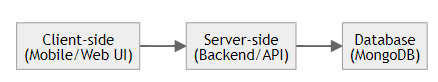

```
Intro to Software EGR - CIS 350
```

<p align="center">
  
</p>

### Department: 

#### GVSU School of Computing

### ChoreMate: 

#### A task management app for roomate chores. 

### Made by:

#### Stephen Robinson | Student ID: G0151664
---
# 1 Abstract
In today's fast-paced world, managing household chores can be a challenging task, especially for roommates sharing a living space. The "Chore Mate" app is designed to simplify and streamline chore management among roommates. This app aims to help roommates efficiently allocate and track chores, ensuring a harmonious and organized living environment.

"Chore Mate" offers a user-friendly platform for roommates to create chore schedules, assign responsibilities, and receive weekly chore assignments. The app not only simplifies chore management but also encourages accountability and collaboration among roommates. Through automated reminders and notifications, "Chore Mate" ensures that no chore is overlooked, making it a valuable addition to any shared living space.


# 2 Introduction
"Chore Mate" is a chore management application designed to address the challenges faced by roommates in coordinating household responsibilities. As a student at [Your University], I, Stephen Robinson (Student ID: G01651664), recognized the need for a simple and effective solution to manage chores within shared living arrangements.


## 2.1 Motivation

With the increasing demand for shared accommodations, effective chore management becomes essential to maintain a clean and organized living space. Traditional methods of handwritten chore lists or verbal agreements often lead to confusion and disagreements among roommates. "Chore Mate" was created to provide roommates with a digital tool that promotes transparency, fairness, and collaboration in chore distribution.

## 2.2 Key Features

- **User Account Creation:** Roommates can set up individual accounts within the app.
- **Chore Assignment:** Roommates can create and assign specific chores to individuals or groups.
- **Chore Scheduling:** The app allows for the creation of weekly chore schedules.
- **Automated Notifications:** Roommates receive automated reminders and notifications for their assigned chores.
- **Accountability Tracking:** "Chore Mate" keeps track of completed and pending chores.
- **Communication Hub:** Roommates can communicate and provide updates related to chores.

## 2.3 How "Chore Mate" Works

Upon creating an account, roommates can collaborate within the app to establish chore assignments and schedules. The app generates weekly chore assignments and sends notifications to remind roommates of their responsibilities. Users can mark chores as completed, allowing for easy tracking of progress. "Chore Mate" fosters a sense of shared responsibility and encourages open communication among roommates.

## 2.4 Benefits

"Chore Mate" offers several benefits to users:

- **Enhanced Organization:** Simplify chore management through a centralized digital platform.
- **Reduced Conflicts:** Clear chore assignments and automated reminders minimize conflicts.
- **Improved Accountability:** Users are more likely to complete chores when tracked digitally.
- **Time Efficiency:** Spend less time coordinating chores and more time enjoying your living space.

## 2.5 Future Developments

"Chore Mate" is a dynamic project with potential future enhancements, including:

- **Integration with Shared Calendars:** Sync chore schedules with personal calendars.
- **Gamification Features:** Introduce rewards and challenges to motivate roommates.
- **Financial Tracking:** Monitor shared expenses related to chores.
- **Community Forum:** Create a space for roommates to discuss and address shared living concerns.

We hope "Chore Mate" simplifies chore management for you and your roommates. Feel free to provide feedback and suggestions for further improvements.


# 3 Architectural Design
My "Chore Mate" app follows a client-server architecture, which is a common design pattern for many modern applications. In this architecture, the system is divided into two main components: the client and the server. Here's how the client-server architecture works for my app:

**Client-side**:
- The client-side represents the part of the application that runs on the user's device, such as a mobile phone or a web browser.
- The client-side is the mobile app or web interface that roommates use to interact with the chore management system.
- Users can create accounts, schedule chores, view notifications, mark chores as completed, and communicate with other roommates through the client-side interface.
- The client-side is responsible for providing a user-friendly and intuitive experience for roommates.

**Server-side**:
- The server-side represents the backend of the application, which runs on a remote server or cloud infrastructure.
- In the app, the server-side handles various functions, such as chore assignment, notification generation, user account management, and chore data storage.
- It communicates with the client-side through APIs (Application Programming Interfaces), which are endpoints that allow the client to send requests and receive responses from the server.
- The server-side processes requests from multiple clients, ensuring data consistency and reliability.

  <p align="center">
  
  <br>
  <br>
  Figure 1: Client Server Architecture of ChoreMate App
  </p>

## 3.1 Class Diagram


## 3.2 Sequence Diagram

### Sequence Diagram for Add Garage


### Sequence Diagram for Inquire Space


# 4 User Guide/Implementation

## 4.1 Client Side

#### 4.1.1 Starting the Application


#### 4.1.2 Registration


#### 4.1.3 LogIn


### 4.2 Home


#### 4.2.1 Vehicle Details


#### 4.2.2 Adding Garage as Renter


#### 4.2.3 Location Selection for Parking


#### 4.2.4 Notification Details


### 4.3 Confirmation and Payment


### 4.4 Server Side


## 5 Future Scope


## 6 Conclusion


## 7 Walkthrough

[](walkthrough_video_link)

